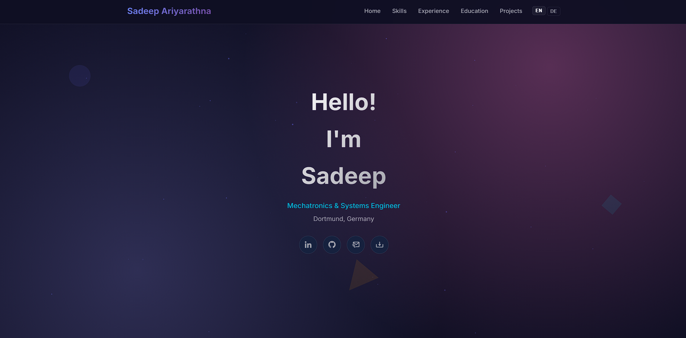

# Sadeep Ariyarathna — Personal Portfolio Website

This site is designed and implemented to showcase my personal projects and achivements. As a mechatronics engieer, my web devolopment skills are at bigginer level. So, during iterative enhancements (i18n support, UX polish, small interactive widgets and convenience features), some development assistance was obtained LLMs to understand and learn how to impliment these features to enhance user experince.

## Features

- Responsive, modern portfolio layout with hero, skills, projects, timeline (work & education), and contact links.
- CV download dropdown linking to English and German PDF versions.
- Client-side i18n: translations are stored in `translations.json` and the language can be switched between English and German.
- Floating back-to-top widget with subtle flash animation and idle auto-hide behavior.
- Navbar that hides when scrolling past the hero section for a cleaner reading experience.
- Smooth scrolling and reveal animations for performance-friendly UX.

## Tech stack & patterns

- HTML5, modern CSS (custom properties, animations) and vanilla JavaScript.
- Uses `IntersectionObserver` for scroll-driven UI and reveal effects.
- Client-side fetch of `translations.json` for runtime i18n.

## Files of interest

- `index.html` — main site markup and content.
- `style.css` — site styling and theme variables.
- `scripts.js` — interactive behavior (i18n loader, widgets, observers).
- `translations.json` — English and German translation key/value map.
- `cv/` and `cv_de/` — folders containing the English and German CV PDF files.
